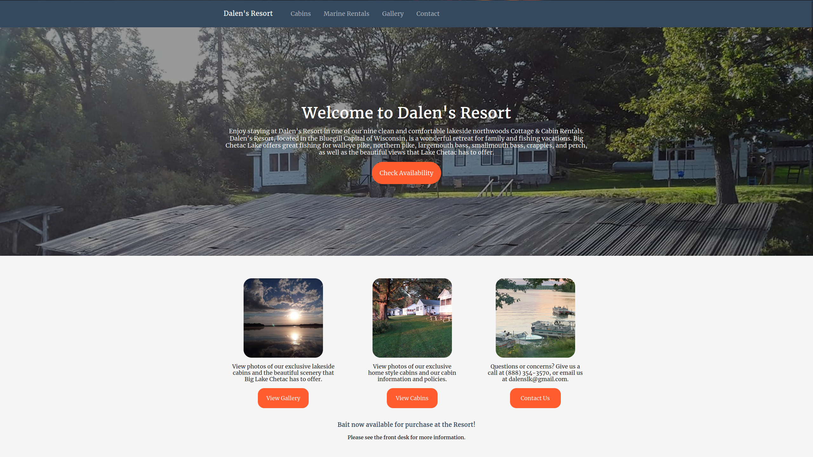

# Dalen's Resort
A website built with Gatsby for Dalen's Resort, a beautiful fishing resort I love to visit in the Summer. This project allowed me to level up my software development to the next level, and identify, correct, and upgrade mistakes and features in my previous Gatsby website. After a bit of trial and error, features such as using markdown to list cabin features, along dynamic page and meta data generation let me understand the more advanced capabilities that React and Gatsby were capable of.

## Project Rundown

This website was redevelopement of an earlier version I made in WordPress when first starting out as a software developer. It was an amazing experience to rebuild the website from the ground up with the Gatsby framework and see the performance of the website improve with every new line of code.
