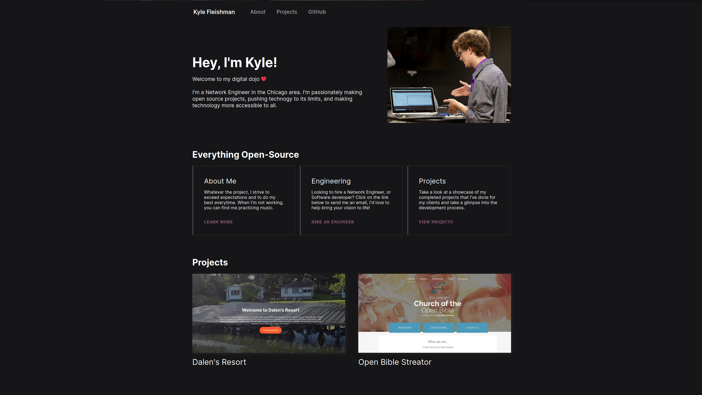

# Kyle Fleishman
My portfolio and blog built with Gatsby, this project was a tremendous learning experience and was fun to brush-up and refine my front-end software development skills. The website allowed me to create a template of reusable components and pages culminated from best practice web development techniques and JavaScript programming, which I will be able to use in my future projects.

# Project Rundown
This website was a culmination of experiences learned throughout my years as a software developer. It was made over the course of 4 weekends of researching best practices in dynamic web design to deliver a final product I am more than proud of.
